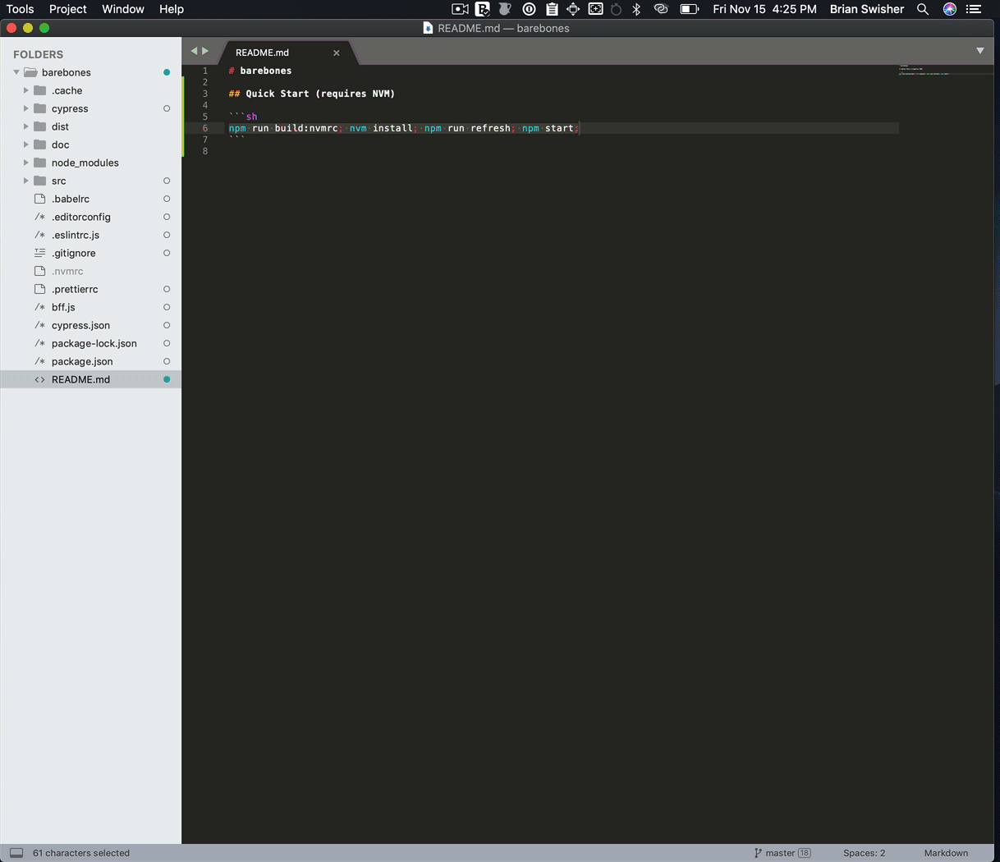
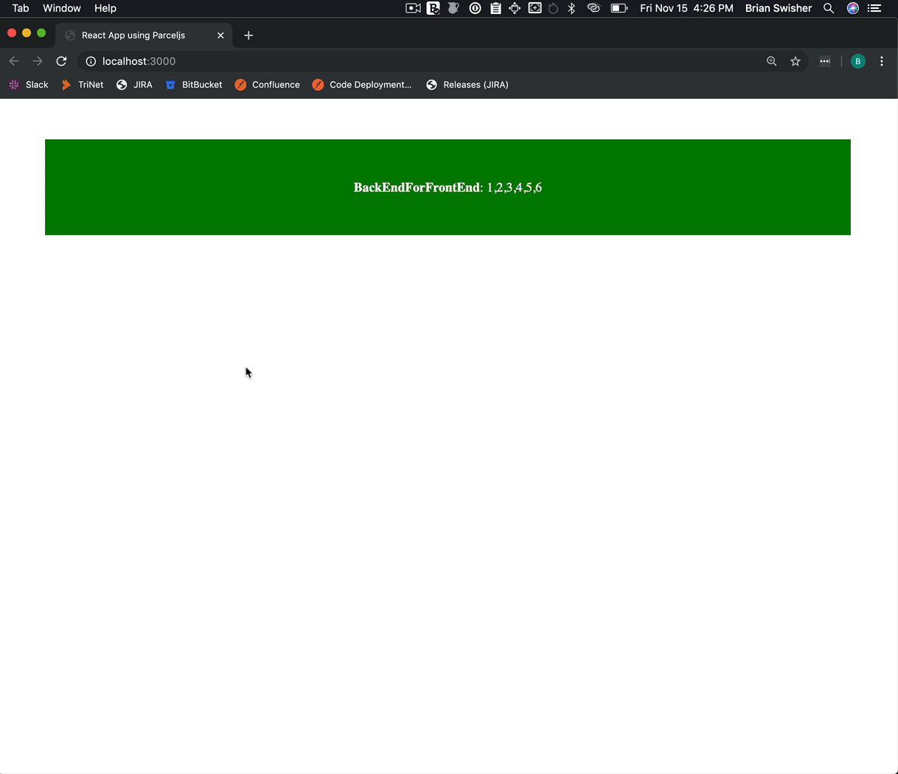
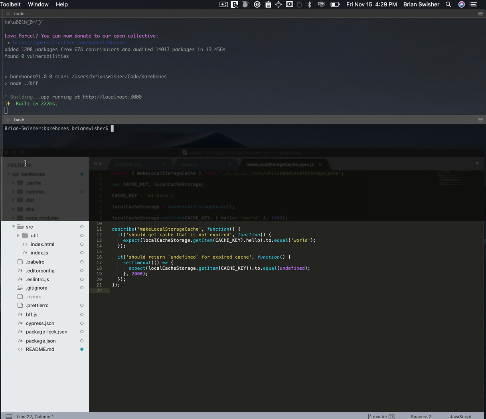

# barebones

## Quick Start (requires NVM)

```sh
npm run build:nvmrc; nvm install; npm run refresh; npm start;
```



## Hot Module Reload (HMR)



## Tests (cypress)



## Lint


## Build

```sh
npm run build
```


